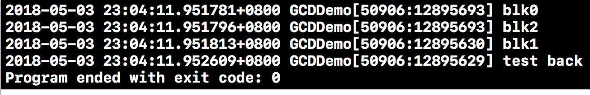

#作业
Main Dispatch Queue 
>*/ 
dispatch_queue_t mainDispatchQueue = dispatch_get_main_queue(); 
/* 
Global Dispatch Queue(高) 
*/ 
dispatch_queue_t globalDispatchQueueHigh = dispatch_get_global_queue(DISPATCH_QUEUE_PRIORITY_HIGH, 0); 
/* 
Global Dispatch Queue(默认) 
*/ 
dispatch_queue_t globalDispatchQueueHigh = dispatch_get_global_queue(DISPATCH_QUEUE_PRIORITY_DEFAULT, 0); 
/* 
Global Dispatch Queue(低) 
*/ 
dispatch_queue_t globalDispatchQueueHigh = dispatch_get_global_queue(DISPATCH_QUEUE_PRIORITY_LOW, 0); 
/* 
Global Dispatch Queue(后台) 
*/ 
dispatch_queue_t globalDispatchQueueHigh = dispatch_get_global_queue(DISPATCH_QUEUE_PRIORITY_BACKGROUND, 0);
思考：这种优先级一定会有吗？

这种优先级并不绝对存在，优先级只是告诉系统优先执行，并非首先执行，也并不代表先结束执行。并且在异步多线程中，那一个线程先执行是不知道的。

>练习：NSDate合成struct timespec类型 

```
struct mytimespec{
    double sec;
    double nsec;
};

 double date1 = [[NSDate date] timeIntervalSince1970];
 double date2 = [[NSDate date]timeIntervalSince1970];
        date.sec = date2 - date1;
        date.nsec = date.sec * 1000000000;
```

>思考：查看输出结果，为什么有这种现象。练习：使用另两种方法实现。（dispatch_set_target_queue,dispatch_sync或dispatch_group_wait）


输出结果

在异步执行中，开启新队列，而实现顺序是系统随机的


```
//        实现dispatch_sync
        dispatch_sync(queue1, ^{
            NSLog(@"test1------queue1%@",[NSThread currentThread]);
        });
        dispatch_sync(queue1, ^{
            NSLog(@"test2------queue1%@",[NSThread currentThread]);
        });
        dispatch_sync(queue1, ^{
            NSLog(@"test3------queue1%@",[NSThread currentThread]);
        });
        dispatch_async(queue1, ^{
            NSLog(@"test4------queue1%@",[NSThread currentThread]);
        });

//        实现dispatch_set_target_queue
        
        void (^queue3)() = ^(){
            NSLog(@"test5------queue3%@",[NSThread currentThread]);
        };
        
        dispatch_queue_t queue4 = dispatch_queue_create("testqueue.5", DISPATCH_QUEUE_CONCURRENT);
        dispatch_sync(queue4, ^{
            NSLog(@"test queue4------%@",[NSThread currentThread]);
        });
        
        dispatch_set_target_queue(queue4, queue1);
        
        dispatch_sync(queue1, queue3);
```

