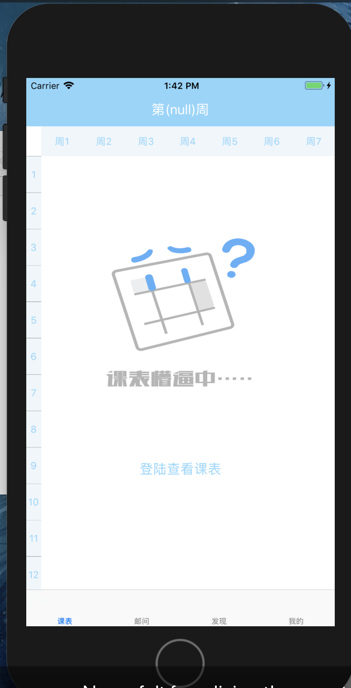
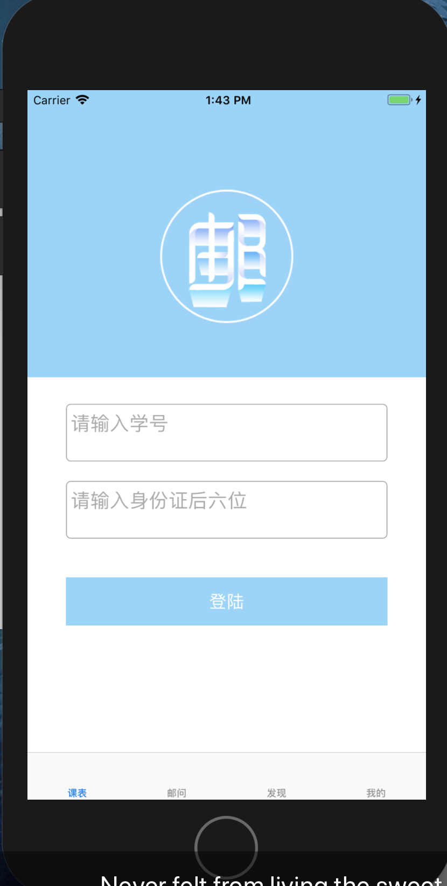
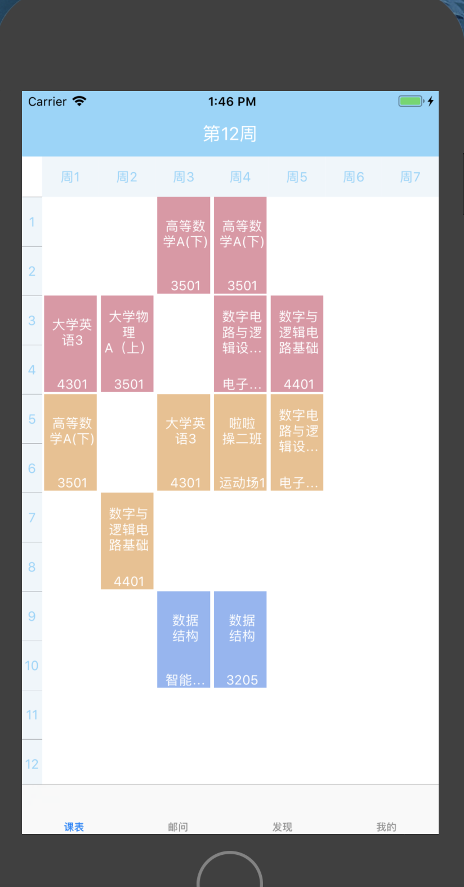
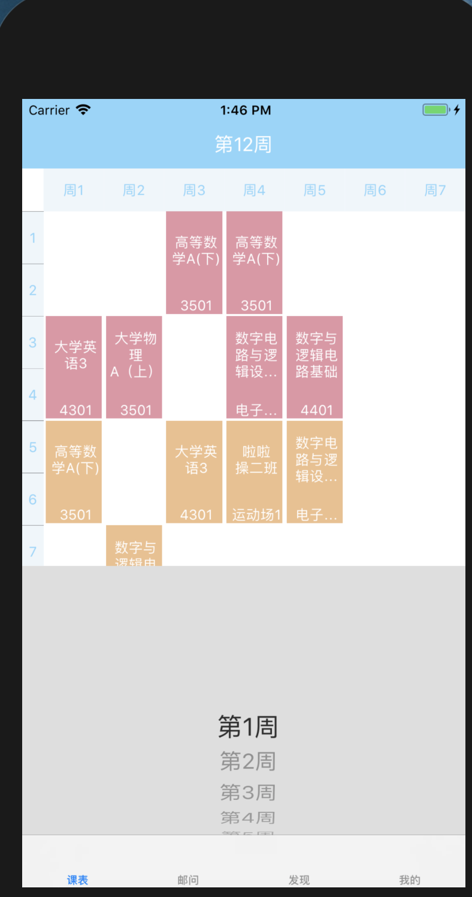
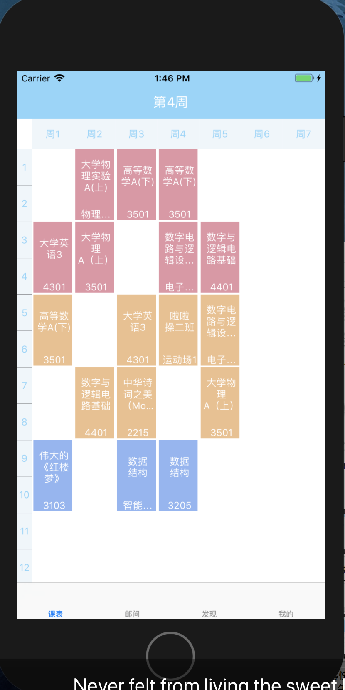
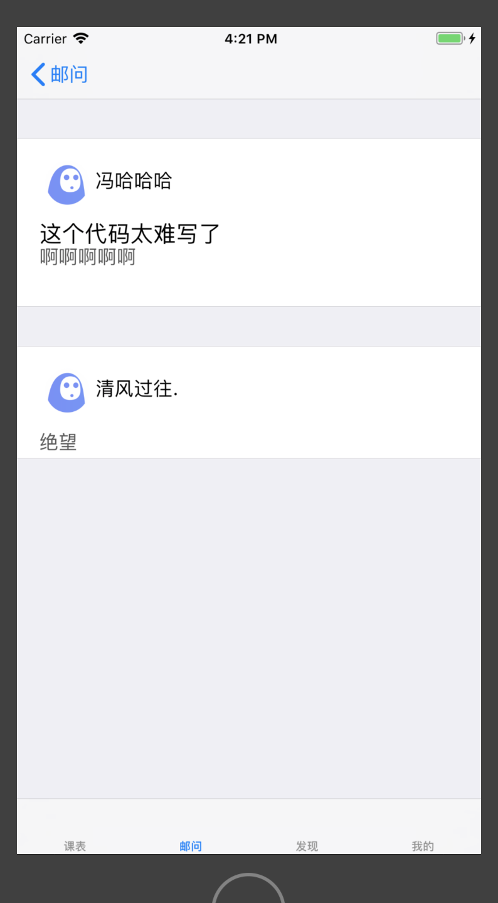
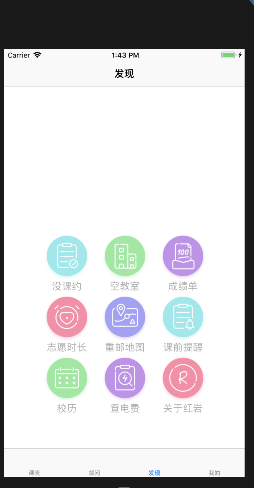
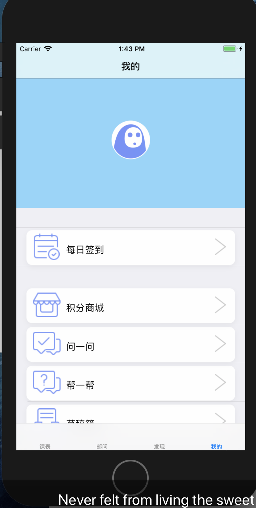

##README

###实现功能、页面
####没有登录的页面

####登录页面
点击登录

####查看课表

点击上方button选择要看的周数弹出pickerView选择，然后刷新页面

####邮问页面

####邮问详情页面

####发现页面

####个人中心

###缺点&未实现功能
没有设置问题分类、点赞、评论数。邮问页面没有写用户提问的页面和上传过程。课表页面换星期数响应慢（尝试用多线程解决，开个线程解析每周的课表array，但是没有做出来），换多了会出bug（不响应了直接(╯°□°）╯︵┻━┻），感觉也是因为生成每周课表的数组，遍历过程太慢。。。
